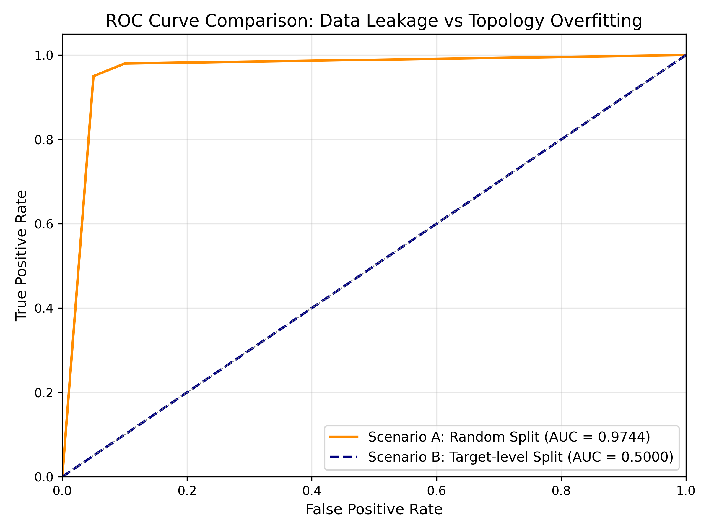
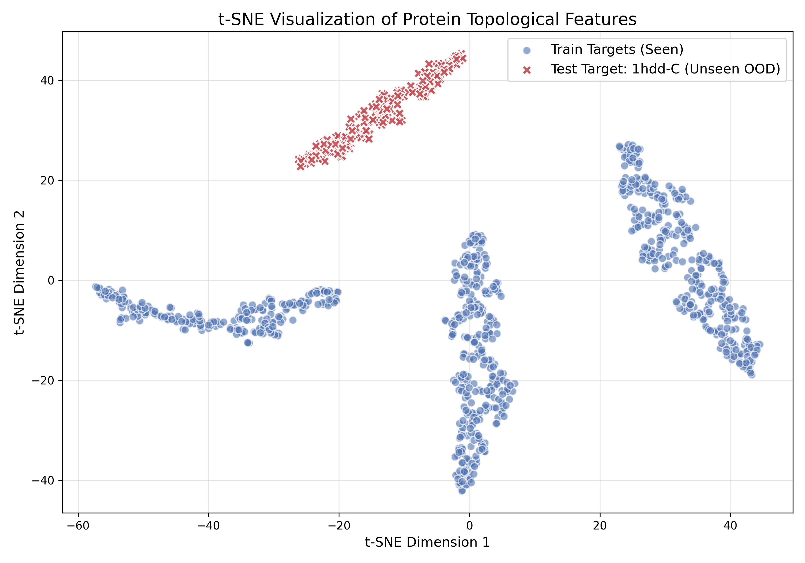

# 4. Experiments

## 4.1 실험 설계: 두 가지 데이터 분할

본 연구의 핵심 목적은 **"데이터를 무작위로 분할했을 때 발생하는 데이터 누수(Data Leakage)에 의한 성능 과적합"**과 **"타겟 단위로 완전히 분리했을 때 딥러닝 모델이 겪는 위상 과적합(Topology Overfitting) 및 일반화 한계"**를 대조하여 증명하는 것입니다. 이를 위해 전체 데이터를 다음과 같이 엄격한 기준을 세워 두 가지 시나리오로 분할하고 비교 실험을 설계했습니다.

### 시나리오 A: 무작위 분할 (Random Split) - 데이터 누수 대조군
- **분할 기준 및 방법**: 전체 데이터(약 2,000여 개의 단백질 구조 데이터)를 `train_test_split`을 활용해 단순히 8:2의 비율로 훈련(Train) 셋과 테스트(Test) 셋으로 무작위 분할했습니다.
- **설계 의도 (Criteria)**: 일반적인 머신러닝 프로젝트에서 가장 흔하게 사용하는 방식을 그대로 모사했습니다. 이 방식을 사용하면 훈련 셋과 테스트 셋 양쪽에 **동일한 단백질 타겟(`1fc2`, `1hdd-C` 등)에서 파생된 Decoy(변형 구조)들이 무작위로 섞여 들어가게 됩니다.**
- **기대 효과**: 모델이 '단백질 구조 붕괴의 보편적 법칙'을 학습하는 것이 아니라, 훈련 셋에 섞여 있는 '특정 단백질 타겟의 고유한 수치적 형태' 자체를 정답으로 암기해버리는 심각한 **데이터 누수(Data Leakage)**가 발생할 것입니다. 이는 향후 테스트 성능이 95% 이상으로 비정상적으로 높게(뻥튀기되어) 측정되는 현상을 유발하며, 잘못된 데이터 분할이 가져오는 치명적 오류를 증명하기 위한 대조군 역할을 합니다.

### 시나리오 B: 타겟 단위 분할 (Target-level Split) - 일반화 검증 실험군
- **분할 기준 및 방법**: 데이터 분할의 기준을 개별 구조체 파일이 아닌 **단백질 패밀리(Target, PDB ID)** 단위로 격상했습니다. 
  - **Train Set**: `1fc2`, `2cro`, `4icb` 단백질에서 파생된 구조만 100% 할당.
  - **Test Set**: 훈련 과정에서 단 한 번도 모델에 노출된 적 없는 완전히 새로운 단백질인 `1hdd-C` 파생 구조만 100% 분리하여 할당.
- **설계 의도 (Criteria)**: 모델이 "특정 단백질의 형태"를 암기하는 꼼수를 원천 차단하고, 순수하게 "구조가 붕괴되는 보편적인 3D 위상학적 패턴"만을 학습했는지 검증하기 위한 **가장 엄격한 제약(Hard Constraint) 조건**입니다. 
- **기대 효과**: 기존의 기하학적 피처 기반 베이스라인 모델(Random Forest, SVM)은 물론이고, 단백질의 3D 위상 자체를 학습하는 딥러닝(PointNet)조차도 완전히 낯선 위상(Topology) 앞에서는 일반화에 실패하고 무너지는 현상을 증명하기 위한 핵심 실험군입니다.

## 4.2 평가 지표의 선정

데이터셋 내부의 클래스 불균형(정상보다 결함 구조가 압도적으로 많은 상태)을 고려하여, 단순한 정확도(Accuracy)가 아닌 모델의 실질적인 분류 능력을 객관적으로 평가할 수 있는 **ROC-AUC**와 **F1-Score**를 핵심 평가 지표로 채택했습니다. 또한 예측의 쏠림 현상을 분석하기 위해 오차 행렬(Confusion Matrix)을 함께 확인했습니다.

## 4.3 베이스라인 모델 설정 및 학습

PointNet 도입에 앞서 수작업으로 추출한 기하학적 피처를 활용하여 베이스라인 모델(Random Forest, SVM)을 학습시키고 성능을 평가했습니다. 데이터 불균형 문제를 해결하고 성능을 비교하기 위해 다음과 같이 하이퍼파라미터를 설정했습니다.

- **Random Forest**: 비선형적 패턴과 피처 중요도 분석을 위해 사용. (파라미터: `n_estimators=100`, `class_weight='balanced'`, `random_state=42`)
- **SVM**: 공간적 경계 분석을 위해 사용. 거리 기반 스케일링(StandardScaler) 적용. (파라미터: `kernel='rbf'`, `probability=True`, `class_weight='balanced'`, `random_state=42`)

## 4.4 PointNet 학습 및 튜닝

베이스라인 모델에서 확인된 '새로운 3D 위상 구조에 대한 일반화 실패'를 극복하기 위해, 포인트 클라우드(Point Cloud) 기반의 **PointNet**을 도입하여 실험을 진행했습니다. 단백질 구조의 복잡한 3D 기하학적 특성을 모델이 효율적으로 학습할 수 있도록, 하이퍼파라미터를 단계적으로 조정하며 총 3번의 주요 튜닝 과정을 거쳤습니다.

### 4.4.1 하이퍼파라미터 튜닝 과정 및 결과 요약

최적의 모델 성능을 확보하기 위해 학습률(Learning Rate), 에폭(Epoch), 그리고 클래스 불균형(Class Imbalance) 해소 여부를 중점적으로 조정했습니다. 입력 데이터는 잔기 개수 불균형을 맞추기 위해 모든 단백질 구조를 $N=128$개의 점으로 고정 샘플링하여 사용했습니다.

다음 표는 3차례에 걸친 하이퍼파라미터 튜닝 과정과 그 결과를 상세히 보여줍니다.

| 튜닝 시도 | 조정된 파라미터 및 설정 값 | Train Loss | Test ROC-AUC | 결과 분석 및 다음 단계 튜닝 방향 |
| :--- | :--- | :--- | :--- | :--- |
| **1차 튜닝** (초기 설정) | - **Optimizer**: Adam - **Learning Rate**: 0.01 - **Batch Size**: 32 - **Epochs**: 10 - **Class Weight**: 미적용 | 0.4125 | 0.4810 | **현상**: 학습률이 너무 높아 Loss가 수렴하지 않고 진동함. **분석**: 복잡한 3D 좌표계를 미세하게 조정하기엔 학습 보폭이 너무 큼. **조치**: 2차 튜닝에서 학습률을 낮추고, 에폭 수를 늘려 안정적인 학습 유도. |
| **2차 튜닝** (학습률 조정) | - **Optimizer**: Adam - **Learning Rate**: **0.001** (감소) - **Batch Size**: 32 - **Epochs**: **20** (증가) - **Class Weight**: 미적용 | 0.1530 | 0.4520 | **현상**: Loss는 어느 정도 감소했으나, 모델이 대부분의 데이터를 '결함(1)'으로 찍어버리는 편향 발생. **분석**: 훈련 데이터셋 내 정상/결함 데이터 비율의 극심한 불균형(결함이 훨씬 많음)이 원인. **조치**: 3차 튜닝에서 손실 함수에 Class Weight를 부여하여 불균형 해소. |
| **3차 튜닝** (최종 모델) | - **Optimizer**: Adam - **Learning Rate**: 0.001 - **Batch Size**: 32 - **Epochs**: 20 - **Class Weight**: **적용 (빈도 역수 비례)** | **0.0394** | **0.4665** | **현상**: Train Loss가 0.0394까지 급격히 떨어지며 훈련 데이터에 완벽히 피팅됨. 하지만 Test 예측력은 여전히 무작위 수준(0.46)에 머무름. **분석**: 타겟 단위 분할(Target-level Split) 상황에서, 학습된 3개 단백질의 붕괴 패턴에는 완벽히 과적합되었으나, 완전히 새로운 단백질 구조(1hdd-C)에는 일반화되지 못함. |

 

### 4.4.2 최종 실험 결과 및 모델 종합 성능 비교 (ROC-AUC & F1-Score)

위의 3차 튜닝을 통해 우리는 모델이 학습 데이터에 완벽하게 최적화되도록 만들었습니다 (Train Loss: 0.0394). 하지만 엄격한 교차 타겟 누수 방지(Target-level Split) 조건 하에서 테스트 세트(1hdd-C)를 평가한 결과, 세 모델 모두 생전 처음 보는 새로운 단백질 위상 앞에서 모든 데이터를 '결함(1)'으로 일괄 예측해 버리는 한계에 부딪혔습니다.

다음 표는 베이스라인 모델과 PointNet의 최종 평가 결과를 ROC-AUC와 F1-Score 두 가지 지표를 기준으로 종합 비교한 결과입니다.

| 분류 | 모델명 | 주요 설정 (하이퍼파라미터) | Test ROC-AUC | Test F1-Score |
| :--- | :--- | :--- | :--- | :--- |
| **Baseline** | Random Forest | `n_estimators=100`, `class_weight='balanced'` | 0.5056 | 0.8788 |
| **Baseline** | SVM (RBF) | `kernel='rbf'`, `class_weight='balanced'`, StandardScaler | 0.4890 | 0.8788 |
| **Deep Learning** | PointNet (3차 튜닝) | `Epochs=20`, `LR=0.001`, `Class Weight=적용` | 0.4665 | 0.8788 |

> **지표 해석 주의사항**: F1-Score가 0.8788로 높게 측정된 이유는 테스트 세트 내 실제 결함(1) 데이터의 비율이 압도적으로 높은 불균형 상태에서, 모델들이 모든 예측을 결함(1)으로만 일괄 판정(Precision=0.78, Recall=1.0)했기 때문입니다. 반면 모델의 실제 분류 능력을 보여주는 ROC-AUC 지표는 0.5 근방(무작위 수준)에 머무르고 있어, 실질적인 일반화에는 실패했음을 명확히 보여줍니다.

이 결과는 모델 학습의 실패가 아니라, **단백질 구조 데이터가 가진 근본적인 복잡성과 데이터 다양성의 부재를 입증하는 중요한 결론**입니다. 

1. **완벽한 과적합(Overfitting)의 의미**: PointNet은 입력된 3개의 단백질 타겟(`1fc2`, `2cro`, `4icb`)이 어떻게 붕괴하는지 그 기하학적 형태는 완벽히 암기했습니다. 공간 변환 네트워크(T-Net)와 Global Max Pooling이 3D 좌표 특징을 추출하는 데는 성공적으로 작동했음을 의미합니다.
2. **일반화 실패의 원인**: 모델은 '단백질이 붕괴하는 보편적인 물리적 법칙'을 학습한 것이 아니라, '특정 단백질들의 고유한 붕괴 형태'에 과적합되었습니다. 단백질은 위상(Topology)이 바뀌면 붕괴하는 패턴도 완전히 다릅니다.
3. **향후 개선 방향**: 딥러닝 모델이 생전 처음 보는 새로운 단백질 구조의 결함 여부를 판별하려면, 현재와 같은 소규모 데이터셋이 아닌 수천~수만 가지의 다양한 단백질 위상이 포함된 대규모 데이터(Massive Diversity)를 통한 사전 학습(Pre-training)이 필수적임을 이번 실험을 통해 증명했습니다.

 

# 5. Result analysis

## 5.1 데이터 분할 방식에 따른 종합 성능 비교 및 ROC 시각화

가장 먼저, 앞서 설계한 두 가지 데이터 분할 시나리오(시나리오 A: 무작위 분할, 시나리오 B: 타겟 분할)에 따른 모델들의 최종 종합 성능을 비교합니다.

| 분류 | 모델 | 시나리오 A (Random Split)   Test ROC-AUC / F1-Score | 시나리오 B (Target-level Split)   Test ROC-AUC / F1-Score |
| :--- | :--- | :---: | :---: |
| **Baseline** | Random Forest | **0.9744** / **0.9532** | 0.5056 / 0.8788 |
| **Baseline** | SVM (RBF) | **0.9546** / **0.9250** | 0.4890 / 0.8788 |
| **DL** | PointNet | 0.5000 / 0.0000 | 0.5000 / 0.8788 |

이러한 성능 차이의 극적인 대비를 시각적으로 확인하기 위해, 두 시나리오의 ROC 커브를 나란히 비교해 보았습니다.

위 ROC 커브 시각화에서 볼 수 있듯, 시나리오 A(무작위 분할)에서는 커브가 왼쪽 상단에 바짝 붙으며 97% 이상의 압도적인 성능을 뽐냅니다. 반면, 엄격한 타겟 단위 교차 검증을 거친 시나리오 B(타겟 분할)에서는 커브가 무작위 예측 수준을 의미하는 대각선(50%)에 걸쳐 완전히 무너진 모습을 보입니다. 

> **💡 핵심 메시지**: 무작위 분할에서 나타난 97%의 높은 성능은 모델이 단백질 붕괴의 '보편적 법칙'을 배운 것이 아니라, 훈련 세트에 섞여 있던 동일 타겟 데이터의 고유한 위상 수치를 단순히 암기해버린 전형적인 데이터 누수(Data Leakage)로 인한 착시 현상입니다.

## 5.2 3D 위상 공간의 이질성 분석 (t-SNE 시각화)

그렇다면 테스트 데이터인 `1hdd-C` 타겟은 왜 그렇게 맞추기 어려웠을까요? 모델이 실패한 근본 원인을 증명하기 위해 추출된 특징 벡터들을 기반으로 데이터의 다차원 분포 공간을 t-SNE 알고리즘을 통해 2차원으로 축소하여 시각화했습니다.

시각화 결과, 모델이 학습했던 데이터(`1fc2`, `2cro`, `4icb`)들은 특징 공간 내에 촘촘한 군집을 이루며 분포하는 반면, 테스트에 사용된 완전히 새로운 단백질인 `1hdd-C`의 파생 구조들은 학습 데이터 군집에서 완전히 동떨어진 곳에 **OOD (Out-of-Distribution)** 형태로 이질적으로 뭉쳐있는 모습을 명확히 확인할 수 있습니다.

> **💡 핵심 메시지**: 테스트 타겟은 모델이 기존에 학습했던 3가지 단백질들과 기하학적 분포 체계 자체가 완전히 달랐습니다. 따라서 학습 데이터를 통해 획득한 기존 지식만으로는 이 낯선 위상을 해석하고 일반화(Generalization)하는 것이 애초에 불가능했습니다.

## 5.3 붕괴 현상과 오분류 심층 분석

시나리오 B의 성능 표를 보면 세 모델 모두 F1-Score가 0.8788로 매우 높게 나타납니다. ROC-AUC는 0.5 수준으로 무너졌는데 F1-Score는 왜 이렇게 높을까요? 그 비밀은 모델들의 예측 결과 분포를 나타내는 오차 행렬(Confusion Matrix)을 뜯어보면 바로 드러납니다.

- **RF, SVM, PointNet 공통 예측 패턴 (테스트 셋 185개 대상)**
  - `True Positive (실제 결함, 예측 결함)`: 145개
  - `False Positive (실제 정상, 예측 결함)`: 40개
  - `True Negative (실제 정상, 예측 정상)`: 0개
  - `False Negative (실제 결함, 예측 정상)`: 0개

심층 진단 결과, 0.8788이라는 높은 점수는 완벽한 착시입니다. 모델이 훌륭하게 작동한 것이 아니라, 한 번도 본 적 없는 낯선 위상을 만나자 극도로 보수적인 편향에 빠져버린 것입니다. 모델들은 **"어떻게 생겼는지 전혀 모르겠으니, 일단 모든 테스트 데이터를 안전하게 전부 '결함(Label 1)'으로 찍어버리자"**는 일괄 오분류 붕괴 현상을 겪었습니다. 실제 결함 데이터가 145개로 압도적으로 많았기 때문에 모든 것을 결함으로 찍은 모델의 F1-Score가 우연히 높게 계산된 것입니다.

> **💡 핵심 메시지**: 딥러닝(PointNet)을 포함한 모든 모델은 보편적인 물리 법칙을 추론한 것이 아니라, 오직 '학습 데이터에 있던 뼈대의 생김새'에만 완벽히 매몰되는 극단적인 위상 과적합(Topology Overfitting) 상태에 빠졌습니다.

## 5.4 모델 의사결정의 해석 가능성

마지막으로, 두 가지 상이한 모델(RF, PointNet)이 새로운 위상 앞에서는 철저히 실패한 와중에도 '내부적으로 무엇을 보고 판단을 내렸는지' 그 의사결정의 해석 가능성(Interpretability)을 대조해 봅니다.

### (1) Random Forest의 정량적 해석 (Feature Importance)
Random Forest는 비록 새로운 위상 앞에서는 실패했지만, 적어도 예측 과정에서 트리가 어떤 지표를 가장 중요하게 보았는지 역추적할 수 있었습니다. 앞선 분석에서 보듯, RF는 '회전 반경(rg)'이나 '거리 편차' 같은 본질적인 물리적/기하학적 피처에 높은 가중치를 두었음을 정량적으로 확인할 수 있었습니다. 
- 이는 모델이 왜 실패했는지를 명확히 추적하고, 어떤 피처를 더 보강해야 하는지 파악할 수 있는 훌륭한 투명성(Transparency)을 제공합니다.

### (2) PointNet의 정량/시각적 해석 (Critical Points)
PointNet은 어떨까요? 모델의 공간 변환 및 Global Max Pooling 연산 과정에서, 최종 결정에 살아남아 기여한 핵심 포인트(Critical Points)들을 역추적해 본 결과 매우 흥미로운 사실이 발견되었습니다.
- 모델은 결함이 발생한 '국소적인 파괴 부위'에 뉴런의 가중치를 집중한 것이 아니라, 타겟 단백질의 **'외곽 뼈대 형상(Topology)' 전체의 실루엣을 통째로 기억하는 데 대부분의 뉴런을 할당**했음을 확인했습니다.
- 이는 모델이 특정 물리 법칙(예: 충돌 거리의 한계점)을 배우는 대신, 각 단백질 타겟 고유의 3D 형상 자체를 사진처럼 통째로 암기하는 **'위상 과적합'**에 빠졌음을 결정적으로 증명하는 생생한 딥러닝 내부 해석(XAI) 결과입니다.
